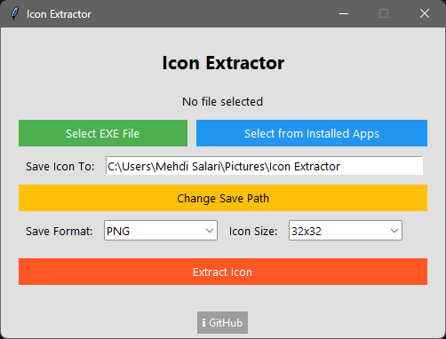

<h1 align="center">
  🧲 Icon Extractor
</h1>

<p align="center">
  
</p>

<p align="center">
  A simple Windows tool to extract icons from `.exe` files using a friendly graphical interface (built with Tkinter).
</p>

## 📸 Screenshot



## ✨ Features

- Extract icons from `.exe` files
- Choose from available icon sizes
- Export icons in `PNG`, `ICO`, or `BMP` format
- Save the extracted icon wherever you want
- Pick from installed programs
- Clean and easy-to-use GUI
- Clickable info button that redirects to this GitHub page

## 📦 Requirements

Install the following Python libraries:

```bash
pip install pillow pywin32
```

## 🚀 Run the Program

Run the following command:

```bash
python icon_extractor.py
```

## 🛠 Build Standalone Executable (Windows)

To build a `.exe` file using [PyInstaller](https://pyinstaller.org/en/stable/):

```bash
pip install pyinstaller
pyinstaller --onefile --noconsole --hidden-import=pefile --hidden-import=PIL --hidden-import=pywin32 --icon=Icon-Exporter.ico icon_extractor.py
```

The `.exe` file will be located inside the `dist/` directory.

## 📁 Folder Structure Example

```css
icon-extractor/
├── assets/
│   └── screenshot.png
│   └── Icon_Extractor.ico
├── icon_extractor.py
├── README.md
├── .gitignore
├── LICENSE
└── requirements.txt
```

---

## 🧑‍💻 Author

Developed by [Mehdi Salari](https://github.com/MehdiSlr)

